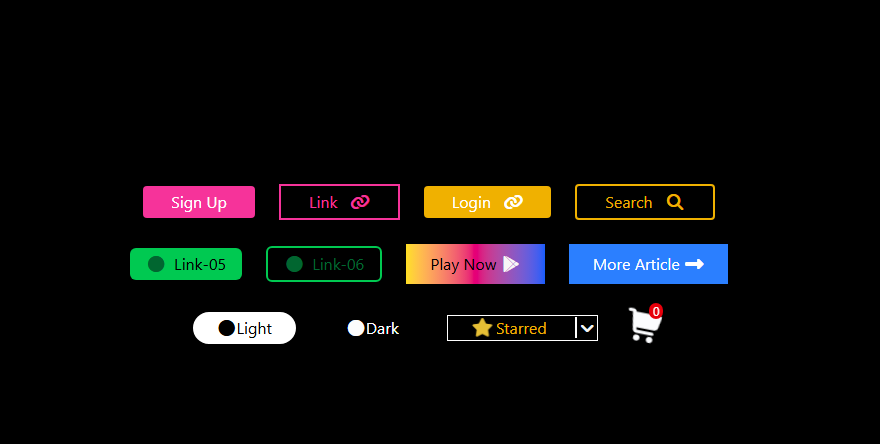

[live@](https://bibincssproject1.netlify.app/)
# 🎨 CSS Project 1 — Button Design Showcase

This project demonstrates a collection of stylish **buttons and UI elements** created using **Tailwind CSS** and **Font Awesome icons**.  
The design focuses on hover effects, gradients, borders, and responsive alignment using modern utility classes.

---

## 🚀 Preview

The layout consists of multiple button styles centered on a dark background for visual contrast.

 <!-- (Optional: add a screenshot link here) -->

---

## 🧱 Features

- ✅ Built with **HTML5** and **Tailwind CSS** (via CDN)
- 💡 Interactive **hover effects** and transitions
- 🌈 **Gradient backgrounds** and color variations
- 🔗 Buttons with **Font Awesome icons**
- 🛒 Example elements such as a **cart icon** with notification badge
- 📦 **Relative and absolute positioning** demo with parent–child box layout

---

## 🧩 Technologies Used

| Technology | Purpose |
|-------------|----------|
| **HTML5** | Structure of the web page |
| **Tailwind CSS** | Styling, layout, and responsive design |
| **Font Awesome** | Icons and visual indicators |

---
